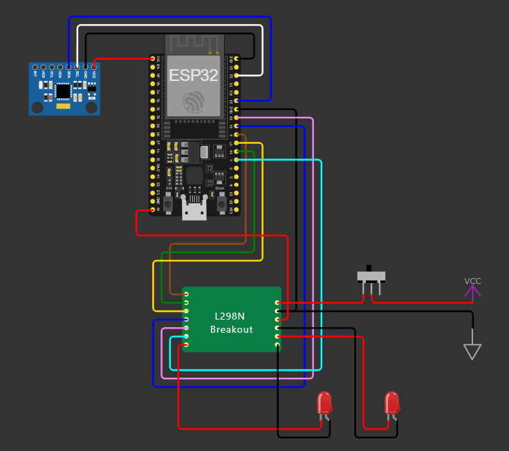

# Self-Balancing Robot Control System

This repository contains the firmware for a self-balancing robot powered by an ESP32 and an MPU6050 sensor. The robot is controlled via a Flutter app (see [robot_control_app](https://github.com/theodorostaloumtzis/robot_control_app)) using WiFi to send movement commands and adjust PID parameters dynamically.

## Features

<<<<<<< HEAD
The **Self-Balancing Robot** is an innovative project designed to create a mobile robot capable of maintaining its balance autonomously while being controlled remotely. Utilizing an **ESP32 microcontroller**, an **MPU6050 sensor**, and a **PID control algorithm**, this robot not only demonstrates advanced robotics concepts but also provides a practical application of Internet of Things (IoT) technologies. Users can command the robot to move in various directions through a user-friendly Flutter mobile application.

## Key Features

- **WiFi-Controlled**: Seamless connectivity allows users to control the robot from anywhere within range.
- **Autonomous Balancing**: The robot utilizes real-time data from the MPU6050 to maintain an upright position, ensuring stability during movement.
- **Directional Movement**: Move the robot forward, backward, left, or right with simple commands from the app.
- **Mobile App Integration**: A dedicated Flutter application offers an intuitive interface for controlling the robot.
- **Real-Time Sensor Feedback**: Continuously monitors pitch and roll angles to adjust movements dynamically.

## Hardware Setup

The **Self-Balancing Robot** requires the following hardware:

- ESP32 Development Board
- MPU6050 Sensor
- L298N Motor Driver
- DC Motors
- Power Supply 12V 
- Switch

## Diagram Circuit



Here you can see the connections based on the code pins assgnments.
=======
- **Self-Balancing**: The robot maintains balance using an MPU6050 sensor and a PID control system.
- **WiFi Communication**: The ESP32 communicates with a mobile app over WiFi, allowing for real-time control and feedback.
- **Dynamic PID Tuning**: Adjust the PID controller values (Kp, Ki, Kd) directly from the mobile app to optimize the robot's performance.
- **Real-Time Status Updates**: The ESP32 provides real-time data such as the pitch angle and PID output to the app.
>>>>>>> 1d2b0a4b10c78841ebd4138eadb6ffd0bfa91e64

## Getting Started

### Prerequisites

- **Hardware**:
  - ESP32 microcontroller
  - MPU6050 sensor for measuring pitch and roll angles
  - Motors and motor driver (e.g., L298N)
  
- **Software**:
  - The ESP32 should be programmed using the Arduino IDE or PlatformIO with this code.
  - Flutter app repository: [robot_control_app](https://github.com/theodorostaloumtzis/robot_control_app) for controlling the robot via WiFi.

### Robot Setup

- **ESP32**: This microcontroller handles the communication with the app and processes the balancing logic using the MPU6050 sensor data.
- **MPU6050**: The sensor measures the pitch angle, which the PID controller uses to keep the robot upright.
- **Motor Driver**: The ESP32 sends PWM signals to the motor driver (e.g., L298N) to control the robot's movement.

### Endpoints

The ESP32 provides the following HTTP endpoints:

- `/command?command=<ACTION>`: Accepts movement commands. Valid actions are `FORWARD`, `BACKWARD`, `LEFT`, `RIGHT`, and `STOP`.
- `/status`: Returns the current pitch angle and PID output in real-time.
- `/set_pid?Kp=<value>&Ki=<value>&Kd=<value>`: Sets the PID controller values based on user input from the app.

### Example Commands

- **Movement Commands**:  
  To move the robot, send a command like:
  ```bash
  http://<robot-ip>/command?command=FORWARD
  ```
  
- **Set PID Values**:  
  Adjust PID parameters dynamically using:
  ```bash
  http://<robot-ip>/set_pid?Kp=1.0&Ki=0.1&Kd=0.05
  ```

- **Fetch Status**:  
  Get the current pitch angle and PID output with:
  ```bash
  http://<robot-ip>/status
  ```

## License

This project is licensed under the MIT License - see the [LICENSE](LICENSE) file for details.

## Author

- **Theodoros Taloumtzis** - [GitHub](https://github.com/theodorostaloumtzis)
